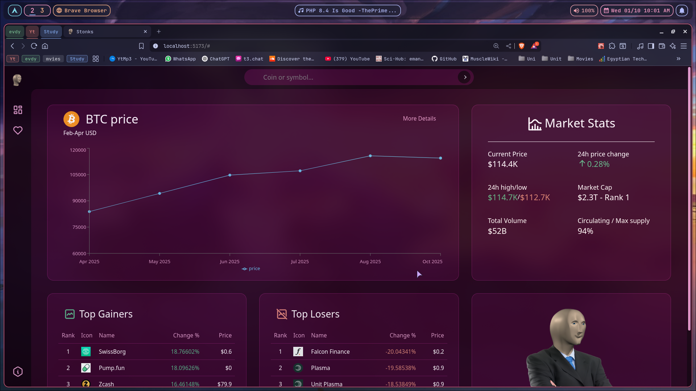
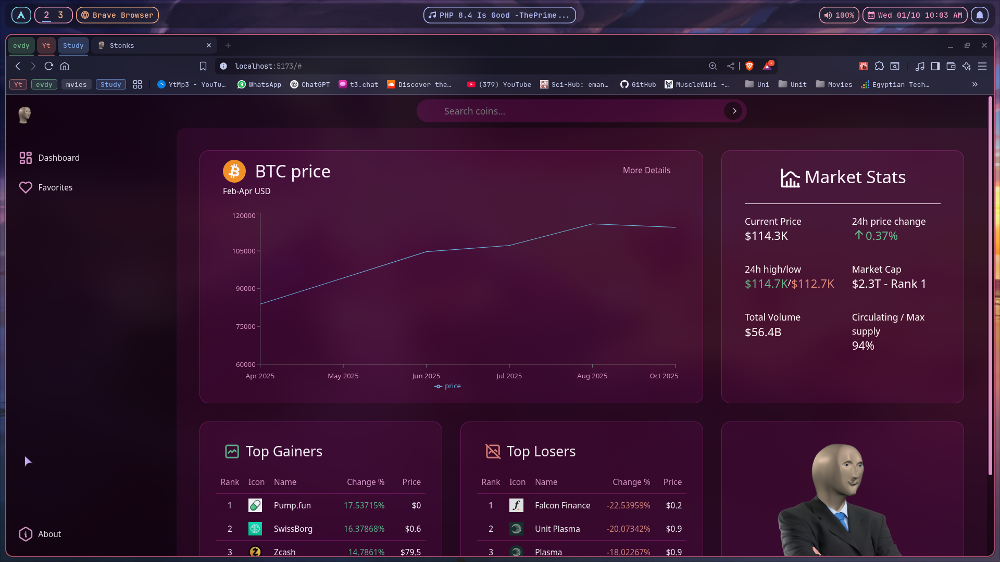

# Stonks 📊

Stonks is a **crypto market dashboard** built with React, React-router, and TypeScript.  
It consumes data from the CoinGecko API to display market information, price charts, and top gainers in a dashboard interface.  

---

## About the Project

This project was created as my first **React frontend project**.  
The main goal was to get comfortable building with React, so that in the future I can extend this project further or create something more complex. For example, integrating my own restAPI or additional features on top of the current dashboard.  

---

## Tech Stack

- **Core:** React (with TypeScript) · React Router · Tailwind CSS  
- **API:** CoinGecko  
- **UI Components:** Aceternity UI · shadcn/ui  

---

## AI Assistance

I used AI for roughly **10%** of this project.  
My primary goal was to **learn React, TypeScript, and frontend development**, so the majority of the work (architecture, data flow, components, integrations) was done by me.  

AI was mainly used as:
- A **Q&A assistant** to understand concepts I was stuck on  
- A way to explore **best practices** and better approaches  
- Help with **small refactors or debugging issues**  
- Most of this README.md file

All key logic, design decisions, and implementations were led by me — AI was used as a **learning companion**, not as a replacement for development.

---

## Dashboard Content

- Cryptocurrency price data and statistics (via CoinGecko API)  
- Price history visualization with charts  
- Top Gainers leaderboard  

---

## Screenshots





---

## Get Started

Clone the project and install dependencies:

```bash
git clone https://github.com/Youssef-codin/stonks.git
cd stonks
npm install
npm run dev
```

---

## Environment

Add a `.env` file in the project root:

```env
VITE_API_KEY=your-coingecko-api-key
```

---

## Limitations

- Responsiveness on small devices still needs refinement  
- Some routes (About, Search) are placeholders and not yet functional
